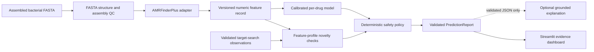

# Genome Firewall

### Fast genomic AMR research signals that know when not to answer

Genome Firewall is a hackathon-ready research prototype that turns an assembled bacterial FASTA into an auditable antimicrobial-response report. Its differentiator is **selective prediction**: a result can be `LIKELY_TO_FAIL`, `LIKELY_TO_WORK`, or an intentional `NO_CALL` when the system cannot support a trustworthy answer.

> **RESEARCH PROTOTYPE - NOT FOR CLINICAL USE.** This report provides genomic decision support only and does not select treatment. Every antibiotic-response result must be confirmed with standard laboratory susceptibility testing and reviewed by a trained healthcare or laboratory professional.

No clinical validity or real benchmark performance is claimed. The bundled examples are visibly labeled demonstration fixtures, not patient results or a substitute for laboratory antimicrobial susceptibility testing (AST).

## Why this can win a hackathon

- **Trust is part of the product:** uncertainty, unsupported inputs, target ambiguity, and evidence conflicts produce an explicit no-call.
- **A real scientific baseline:** one sparse, calibrated model per supported drug, with thresholds learned separately from model fitting.
- **Leakage-aware contract:** genomic/homology groups stay disjoint in fitting and calibration; any held-out release artifact must pass the same audited group boundary.
- **Evidence without theater:** curated genes/mutations are visually separated from non-causal statistical associations.
- **A molecular-target safety gate:** a likely-to-work call requires more than the absence of a known resistance marker.
- **Demo resilience:** deterministic offline examples work without a network, an API key, or a live AMRFinderPlus database.
- **Grounded optional AI:** OpenAI may prioritize existing evidence IDs; all displayed prose remains deterministic and cannot create or change the result.

## System at a glance



The canonical `PredictionReport` is the product boundary. The interface and optional explanation layer render that validated object; neither may reach back and alter the model score, evidence, target state, threshold, or call.

## Run the polished demo

Requirements: Python 3.11 or 3.12. AMRFinderPlus and an OpenAI key are **not** required for demo mode.

### Windows PowerShell

```powershell
Copy-Item .env.example .env
py -3.12 -m venv .venv
.venv\Scripts\python -m pip install --upgrade pip
.venv\Scripts\python -m pip install -e ".[dev]"
.venv\Scripts\python -m streamlit run app.py
```

### macOS or Linux

```bash
cp .env.example .env
python3.12 -m venv .venv
. .venv/bin/activate
python -m pip install --upgrade pip
python -m pip install -e ".[dev]"
python -m streamlit run app.py
```

Open [http://localhost:8501](http://localhost:8501). The landing page identifies demo data before analysis. Use the prepared examples to show:

1. A likely-to-fail result with disclosed determinant evidence.
2. A target-confirmed likely-to-work path.
3. A deliberate no-call caused by uncertainty or conflicting evidence.

The cases were chosen to demonstrate product behavior. They are not evaluation samples unless their provenance explicitly says so, and their outcomes must not be used as benchmark metrics.

### Make shortcuts

```bash
make install-dev
make run
make check
```

`make check` runs lint, formatting verification, and the test suite.

## Deploy on Vercel

The repository includes a dedicated ASGI adapter in `asgi.py`. It exports the
top-level `app` variable required by Vercel while continuing to run the existing
Streamlit interface from `app.py`.

1. Import the GitHub repository into Vercel.
2. Select **Python** as the Framework Preset.
3. Keep the Root Directory set to the repository root (`.`).
4. Leave Build Command and Output Directory empty so Vercel uses the checked-in
   Python configuration.
5. Deploy. Future commits to the connected branch will trigger new deployments.

`vercel.json` enables Fluid compute, selects the Python runtime, and removes test
and development-only directories from the function bundle. `.python-version`
pins the deployment to Python 3.12. Streamlit uses a WebSocket connection for its
interactive session, so verify both the page load and one demo interaction in the
deployment preview before promoting it to production.

The scientific Python dependency bundle uses Vercel Large Functions. New
projects are enrolled automatically; for an existing project, add the
non-secret environment variable `VERCEL_SUPPORT_LARGE_FUNCTIONS=1` to Preview
and Production before redeploying.

Vercel [limits a Function request body to 4.5 MB](https://vercel.com/docs/functions/limitations#request-body-size).
Use the prepared demo fixtures for the hosted judge walkthrough; run the Docker
deployment, or add a reviewed direct-to-object-storage upload flow, for larger
genome files.

## Docker demo

The default image is deliberately small and offline-friendly. It runs the disclosed demo and does not pretend that AMRFinderPlus is installed.

```bash
docker build --tag genome-firewall:local .
docker run --rm --publish 8501:8501 genome-firewall:local
```

To pass local configuration, create `.env` from `.env.example`, keep secrets out of Git, and run:

```bash
docker run --rm --publish 8501:8501 --env-file .env genome-firewall:local
```

If trained artifacts or a pinned AMRFinderPlus database are used, mount them read-only and point the corresponding environment variables at the container paths. Do not bake private genomes, API keys, or unreviewed model files into an image.

## Two execution paths, no silent substitution

| Input path | What it does | What it proves |
|---|---|---|
| Disclosed demo fixture | Loads deterministic, visibly labeled examples | Product behavior and safety UX only |
| Uploaded FASTA | Attempts version-compatible artifacts and local annotation; otherwise returns a no-call | Only capabilities supported by installed, pinned artifacts |

The interface exposes both paths. An upload is never replaced with a demo fixture. For trained inference, the artifact directory must contain `manifest.json`, one `<safe-drug>.joblib` file per supported drug, and a reviewed `release_evaluation.json` with its detached SHA-256 file. The registry records feature order, estimator/calibrator, thresholds, species/drug/model/schema versions, annotation provenance, and actual training/calibration support counts. Metrics remain empty until genuine evaluation is run.

Uploaded inference fails closed if artifacts, annotation, target checks, or versions are missing. In the validated report, trained computation is represented as `LIVE` / `MODEL_DERIVED`; fixtures are `DEMO` / `DEMONSTRATION_FIXTURE`.

### Start trained mode

Windows PowerShell:

```powershell
$env:GENOME_FIREWALL_ARTIFACT_DIR = (Resolve-Path artifacts)
$env:GENOME_FIREWALL_ALLOW_LIVE_ANNOTATION = "true"
$env:AMRFINDER_BIN = "amrfinder"
$env:AMRFINDER_DB = (Resolve-Path path\to\pinned-amrfinder-db)
.venv\Scripts\python -m streamlit run app.py
```

macOS or Linux:

```bash
export GENOME_FIREWALL_ARTIFACT_DIR="$PWD/artifacts"
export GENOME_FIREWALL_ALLOW_LIVE_ANNOTATION=true
export AMRFINDER_BIN=amrfinder
export AMRFINDER_DB=/path/to/pinned-amrfinder-db
python -m streamlit run app.py
```

This command is intentionally not a promise that a model exists. The app should show unsupported/no-call until compatible, genuinely trained artifacts have been supplied.

## Input contract

Interactive input is an **assembled nucleotide FASTA**, not raw reads or a clinical sample. The app performs structural checks and assembly-level QC before any annotation or inference. It rejects malformed content and no-calls quality failures rather than trying to repair them silently.

Example:

```text
>contig_001
ACGTTGCAACGTTGCAACGTTGCA
>contig_002
TTGACCGATGACCGATGACCGATG
```

Do not upload human sequence, identifiers, mixed/contaminated cultures, files you are not authorized to process, or organisms outside the displayed support scope. Uploaded sequence is not sent to OpenAI.

## Dataset ingestion schema

Training begins from one laboratory-measured sample/drug observation per row. CSV or Parquet is recommended.

```csv
sample_id,species,drug,phenotype,group_id,assembly_path,source_dataset,ast_method,breakpoint_standard,breakpoint_version
iso_0001,Escherichia coli,ciprofloxacin,R,group_004,data/assemblies/iso_0001.fna,organizer_snapshot,broth_microdilution,EUCAST,pinned-by-organizer
iso_0002,Escherichia coli,ciprofloxacin,S,group_019,data/assemblies/iso_0002.fna,organizer_snapshot,broth_microdilution,EUCAST,pinned-by-organizer
```

Required fields:

| Field | Contract |
|---|---|
| `sample_id` | Stable, unique, de-identified join key |
| `species` | Canonical organism name; never inferred from a filename |
| `drug` | Canonical drug identifier |
| `phenotype` | Measured `R` or `S`; missing is never converted to `S` |
| `group_id` | Genetic/homology group kept wholly within one partition |
| `assembly_path` | Authorized assembled nucleotide FASTA path when annotation is required |

Recommended provenance fields are `source_dataset`, `ast_method`, `breakpoint_standard`, and `breakpoint_version`. Site, year, AST method, filename, lineage labels, and phenotype-derived columns are for auditing and stratification—not predictive shortcuts.

Before training, remove or adjudicate conflicting duplicate-cluster labels, exclude intermediate/SDD/unknown values unless a protocol was frozen in advance, and keep the organizer test set untouched. Full rules live in [the model card](docs/MODEL_CARD.md).

### Train version-pinned artifacts

The feature table must have been produced with the same AMRFinderPlus executable, database, and feature-schema version that will be used at inference. Their exact recorded identifiers are mandatory:

```bash
python scripts/train.py \
  --features data/features.csv \
  --labels data/labels.csv \
  --output-dir artifacts \
  --amrfinder-version "<exact version from feature-generation job>" \
  --amrfinder-database-version "<pinned database version/hash>"
```

The command fits and calibrates on group-disjoint partitions. It does not print or invent held-out test performance. A separate, untouched evaluation workflow must produce the hash-bound release artifact before trained calls are eligible or any number is added to the UI, pitch, or model card.

CSV works with the default install. For Parquet input, install the explicit optional dependency with `python -m pip install -e ".[parquet]"`.

### Approve a measured release

`config/release_evaluation.example.json` is an intentionally ineligible template. An independent evaluation workflow must replace every placeholder, include measured per-drug class/group support, coverage, called accuracy, false-susceptible rate, and a `policy_constraints_satisfied` decision, then set `release_eligible` only after review. Bind it to the exact `manifest.json`, dataset, split, target workflow, and annotation versions. Finally create `release_evaluation.json.sha256` from the completed JSON. Genome Firewall validates both files before loading model artifacts and rechecks them immediately before prediction.

### Supply target observations without bypassing the gate

A live likely-to-work call also needs observations from a separately validated target-search workflow. The CLI accepts observations—not a final target verdict—and recomputes the target gate from the pinned catalog:

```json
{
  "Ciprofloxacin": {"gyrA": "PRESENT", "parC": "PRESENT"},
  "Ceftriaxone": {"ftsI": "PRESENT"},
  "Gentamicin": {"rrs": "AMBIGUOUS"}
}
```

```bash
python scripts/predict.py assembly.fna \
  --artifact-dir artifacts \
  --catalog config/drug_catalog.yaml \
  --target-hits-json target_hits.json \
  --output report.json
```

The bundled catalog is deliberately `demo_provisional`, so it cannot enable a trained likely-to-work call. A domain reviewer must validate the catalog and the upstream target-search protocol first. Missing or malformed observations remain `NOT_ASSESSED`; they are never interpreted as target absence.

## AMRFinderPlus integration

The Python adapter is designed for an external `amrfinder` executable. It invokes the program without a shell, applies a timeout, parses only expected output, and records executable/database versions. AMRFinderPlus hits are genotypic evidence, not phenotype guarantees.

One reproducible local installation option is a dedicated Bioconda environment:

```bash
micromamba create --yes --name genome-firewall-amr --channel conda-forge --channel bioconda ncbi-amrfinderplus
micromamba run --name genome-firewall-amr amrfinder -u
micromamba run --name genome-firewall-amr amrfinder --version
```

For release artifacts, replace the unversioned package request with the version selected by the team, record the resolved package lock, and retain the database version/hash. A representative nucleotide-assembly invocation is:

```bash
amrfinder -n assembly.fna -O Escherichia -o amrfinder.tsv
```

Use only organism values supported by the installed AMRFinderPlus/database pair. The provisional catalog is not authority to enable a species. If setup or database access is unavailable during judging, use the explicitly disclosed precomputed fixture rather than fabricating live output.

## Optional OpenAI explanation

OpenAI is off by default. It receives a redacted payload of validated enums, drug names, and allowlisted evidence IDs only—never FASTA, contigs, sample IDs, free-form evidence descriptions, raw model state, or direct identifiers. It returns only a constrained ordering plan; the application renders deterministic prose. The default model is configurable and set to `gpt-5.6-terra` in `.env.example`.

```powershell
$env:GENOME_FIREWALL_ENABLE_OPENAI = "true"
$env:OPENAI_API_KEY = "your-key-from-a-secret-store"
$env:OPENAI_MODEL = "gpt-5.6-terra"
.venv\Scripts\python -m streamlit run app.py
```

The Responses API output must follow a fixed plan schema and contain only input drug names and evidence IDs. It cannot write medical claims, change a call, probability, threshold, target, evidence item, or no-call reason, and it cannot recommend or rank treatment. Missing key, timeout, refusal, invalid schema, or an unrecognized ID uses deterministic ordering and copy instead.

## Repository map

```text
genome-firewall/
├── app.py                         Streamlit entrypoint
├── assets/styles.css              Accessible visual system
├── config/drug_catalog.yaml       Provisional, non-clinical product catalog
├── config/release_evaluation.example.json  Ineligible held-out release template
├── docs/MODEL_CARD.md             Data, evaluation, and model limitations
├── docs/SAFETY.md                 Responsible-use and fail-closed policy
├── docs/DATA_CONTRACT.md          Organizer-data and provenance contract
├── docs/DEMO_SCRIPT.md            Three-minute judge walkthrough and Q&A
├── src/genome_firewall/
│   ├── schemas.py                 Validated public contracts
│   ├── fasta.py                   FASTA parsing and assembly QC
│   ├── amrfinder.py               Fail-safe local AMRFinderPlus adapter
│   ├── targets.py                 Reviewed target-catalog gate
│   ├── decision.py                Deterministic no-call safety policy
│   ├── predictor.py               Artifact registry and inference
│   ├── training.py                Group-aware fitting and calibration
│   ├── evaluation.py              Selective-prediction evaluation
│   ├── explanations.py            Grounded narration with safe fallback
│   └── demo.py                    Disclosed deterministic examples
└── tests/                         Contract, QC, decision, and UI smoke tests
```

## Development and verification

```bash
python -m pip install -e ".[dev]"
python -m ruff check .
python -m ruff format --check .
python -m pytest -q
```

High-value release checks:

- Clean environment install and two consecutive end-to-end demo runs.
- Malformed, oversized, ambiguous, and unsupported FASTA paths.
- Work, fail, low-confidence no-call, target-ambiguous no-call, and marker-conflict no-call.
- Missing model, incompatible feature schema, unavailable AMRFinderPlus, and annotation timeout.
- OpenAI disabled, invalid key, timeout, invalid schema, and invented-evidence fallback.
- No secret, sequence, identifier, or misleading metric in logs and exports.

## Three-minute judge flow

1. **Problem:** conventional AST can take time; this provides an earlier *research* signal from an already assembled genome while confirmation is pending.
2. **Scope:** one validated species/data scope, a deliberately small drug set, and three outcomes—including no-call.
3. **Demo:** show a curated-evidence fail path and a target-confirmed work path.
4. **Trust moment:** show a conflict or uncertainty case that refuses to guess.
5. **Scientific proof:** show the empty validation state today, explain the group-disjoint contract, and populate reliability/risk-versus-coverage only after a genuine held-out artifact exists.
6. **Boundary:** ask the explanation panel what to prescribe; it should refuse and repeat the lab-confirmation requirement.

The strongest closing line is simple: **Genome Firewall is useful because it is fast, transparent, and honest about uncertainty.**

## Responsible-use documents

Use the exact [three-minute demo script](docs/DEMO_SCRIPT.md) for judging and the [data contract](docs/DATA_CONTRACT.md) when organizer data arrives. Read [SAFETY.md](docs/SAFETY.md) before using non-demo data and [MODEL_CARD.md](docs/MODEL_CARD.md) before describing model support or performance. Entries in [drug_catalog.yaml](config/drug_catalog.yaml) are provisional interface configuration, not a clinical knowledge base.
